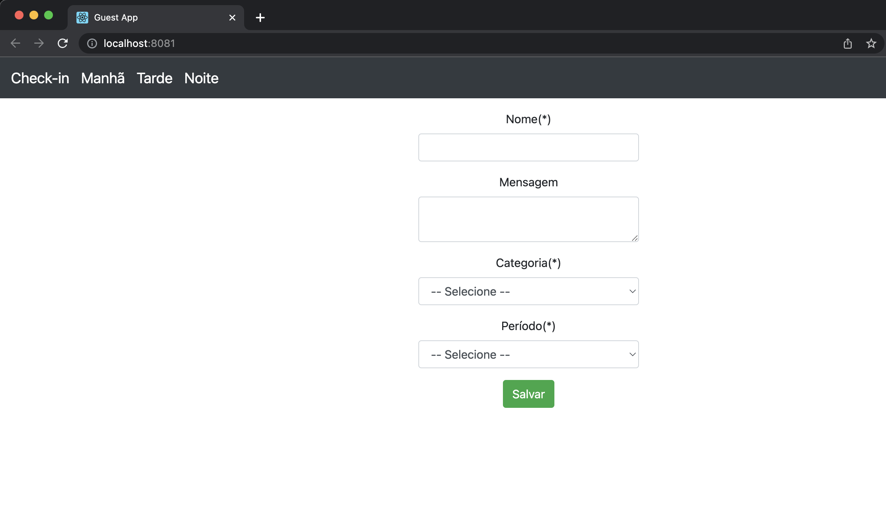
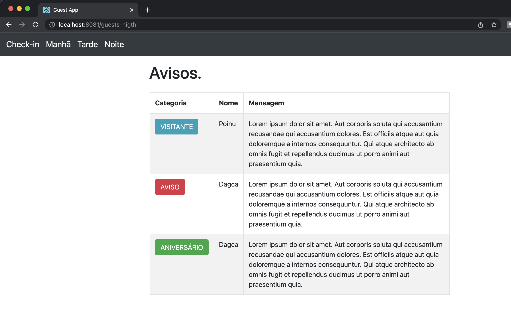

# Guest Front

Frontend made in react to integrate with the Guest API project (taking a look at Readme for you to understand why this frontend), I honestly don't know why I chose to react. I wanted to learn something about frontend, I'm open to changes, I'm still learning, you can criticize

<h4> Imagine backend developing frontend 🫣</h4>


### Prerequisites

Requirements for the software and other tools to build, test and push

- [NodeJs Official Page](https://nodejs.org/en/download/)
- [Docker](https://www.docker.com/)
- [Guest-Api](https://github.com/njaneto/guest-api)
- [Kubernetes](https://kubernetes.io/docs/home/) - optional

## Todo - 😅 👨‍💻

- [X] Initial work - 🥳
- [X] Dockerfile - 🥹
- [X] Kubernetes - 😝
- [X] Warning check in - 🙂
- [X] Warning List - 🙃
- [ ] login - 🫣
- [ ] Test units - 😏
- [ ] Evolution - 👀

## Running 

1. Download and Install NodeJs LTS version from [NodeJs Official Page](https://nodejs.org/en/download/).
2. Navigate to the root ./ directory of the product and run `yarn install` or `npm install` to install our local dependencies.


## Deployment

```
    docker build -t <name-space>/guest-front:<tag> <path>/Dockerfile
```

## Start API 

```
    docker run -it --name guest-front -p 8081:8081 <name-space>/guest-guest:<tag>
```

## Screens








### Contributing Authors

* **Nilo Jose de Andrade Neto** - *Initial work*
